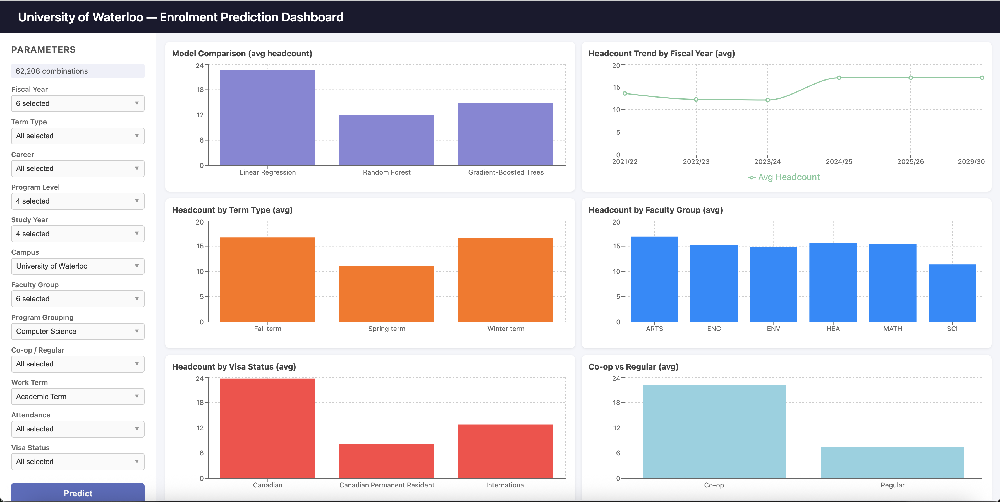

# University of Waterloo Enrolment Prediction

Predict student headcounts at the University of Waterloo using Apache Spark MLlib models served via a FastAPI endpoint.

## Enrolment Prediction Dashboard



## Quick Setup

In the project directory, you can run:

```sh
# Terminal 1 — start the FastAPI backend
python api.py

# Terminal 2 — start the React dev server
cd frontend && npm run dev
```


## Project Structure

```
.
├── api.py                          # FastAPI prediction API
├── group_assignment.ipynb          # Jupyter notebook (EDA, training, evaluation)
├── models/
│   ├── metadata.json               # Model metrics and best-model info
│   ├── gradient_boosted_trees/     # Best model (R² ≈ 0.83)
│   ├── random_forest/
│   └── linear_regression/
└── waterloo-enrolement-2024.csv    # Source dataset
```

## Prerequisites

- Python 3.10+
- Java 17 (required by PySpark)

## Setup

```bash
pip install fastapi uvicorn pyspark
```

> The notebook also uses `matplotlib`, `pandas`, and `numpy`. Install them if
> you want to re-run the training pipeline.

## Starting the API

```bash
python api.py
```

The server starts on **<http://localhost:8000>**.
Interactive docs are available at **<http://localhost:8000/docs>**.

## API Endpoints

### `GET /models`

Returns all available models and their evaluation metrics.

```bash
curl http://localhost:8000/models
```

Example response:

```json
{
  "best_model": "Gradient-Boosted Trees",
  "models": {
    "Linear Regression": {
      "path": "models/linear_regression",
      "RMSE": 27.44,
      "R2": 0.20,
      "MAE": 10.42
    },
    "Random Forest": {
      "path": "models/random_forest",
      "RMSE": 18.51,
      "R2": 0.64,
      "MAE": 6.49
    },
    "Gradient-Boosted Trees": {
      "path": "models/gradient_boosted_trees",
      "RMSE": 12.68,
      "R2": 0.83,
      "MAE": 4.61
    }
  }
}
```

### `POST /predict`

Predict Student Headcounts. Uses the best model by default; pass
`?model_name=<name>` to choose a different one.

**Request body fields:**

| Field              | Example                          |
|--------------------|----------------------------------|
| `fiscal_year`      | `"2023/24"`                      |
| `term_type`        | `"Fall term"`                    |
| `career`           | `"Undergraduate"`                |
| `program_level`    | `"Bachelors"`                    |
| `study_year`       | `"3"`                            |
| `campus`           | `"University of Waterloo"`       |
| `faculty_group`    | `"MATH"`                         |
| `program_grouping` | `"Computer Science"`             |
| `coop_regular`     | `"Co-op"`                        |
| `work_term`        | `"Academic Term"`                |
| `attendance`       | `"Full-Time"`                    |
| `visa_status`      | `"Canadian"`                     |

#### Example — default (best) model

```bash
curl -X POST http://localhost:8000/predict \
  -H "Content-Type: application/json" \
  -d '{
    "fiscal_year": "2023/24",
    "term_type": "Fall term",
    "career": "Undergraduate",
    "program_level": "Bachelors",
    "study_year": "3",
    "campus": "University of Waterloo",
    "faculty_group": "MATH",
    "program_grouping": "Computer Science",
    "coop_regular": "Co-op",
    "work_term": "Academic Term",
    "attendance": "Full-Time",
    "visa_status": "Canadian"
  }'
```

Example response:

```json
{
  "model_name": "Gradient-Boosted Trees",
  "predicted_student_headcount": 42.15
}
```

#### Example — specific model

```bash
curl -X POST "http://localhost:8000/predict?model_name=Random%20Forest" \
  -H "Content-Type: application/json" \
  -d '{
    "fiscal_year": "2022/23",
    "term_type": "Winter term",
    "career": "Graduate",
    "program_level": "Masters",
    "study_year": "N",
    "campus": "University of Waterloo",
    "faculty_group": "ENG",
    "program_grouping": "Electrical and Computer Engineering",
    "coop_regular": "Regular",
    "work_term": "Academic Term",
    "attendance": "Full-Time",
    "visa_status": "International"
  }'
```

Example response:

```json
{
  "model_name": "Random Forest",
  "predicted_student_headcount": 12.87
}
```
